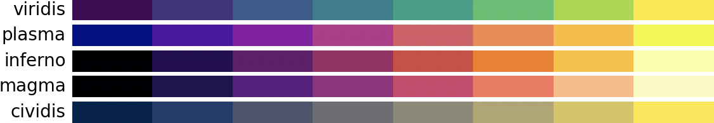
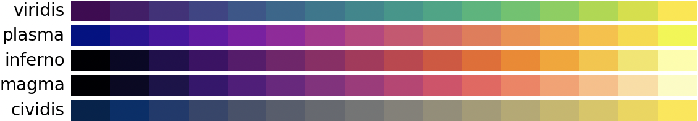

# Color Scales





```py
cividis8 = [
    [0.0, 0.135112, 0.304751],
    [0.130669, 0.231458, 0.43284],
    [0.298421, 0.332247, 0.423973],
    [0.42512, 0.431334, 0.447692],
    [0.555393, 0.537807, 0.471147],
    [0.695985, 0.648334, 0.440072],
    [0.849223, 0.771947, 0.359729],
    [0.995737, 0.909344, 0.217772],
]

cividis16 = [
    [0.0, 0.135112, 0.304751],
    [0.0, 0.18161, 0.421859],
    [0.117612, 0.225935, 0.434308],
    [0.208926, 0.272546, 0.424809],
    [0.279411, 0.318677, 0.423031],
    [0.342246, 0.364939, 0.428559],
    [0.401418, 0.41179, 0.440708],
    [0.458366, 0.459552, 0.460457],
    [0.51792, 0.508454, 0.472707],
    [0.582087, 0.55867, 0.468118],
    [0.648222, 0.610553, 0.454801],
    [0.716177, 0.664384, 0.432386],
    [0.785965, 0.720438, 0.399613],
    [0.857809, 0.778969, 0.353259],
    [0.93218, 0.840159, 0.28588],
    [0.995737, 0.909344, 0.217772],
]

inferno8 = [
    [0.001462, 0.000466, 0.013866],
    [0.15585, 0.044559, 0.325338],
    [0.397674, 0.083257, 0.433183],
    [0.621685, 0.164184, 0.388781],
    [0.832299, 0.283913, 0.257383],
    [0.961293, 0.488716, 0.084289],
    [0.981173, 0.759135, 0.156863],
    [0.988362, 0.998364, 0.644924],
]

inferno16 = [
    [0.001462, 0.000466, 0.013866],
    [0.046915, 0.030324, 0.150164],
    [0.142378, 0.046242, 0.308553],
    [0.258234, 0.038571, 0.406485],
    [0.366529, 0.071579, 0.431994],
    [0.472328, 0.110547, 0.428334],
    [0.578304, 0.148039, 0.404411],
    [0.682656, 0.189501, 0.360757],
    [0.780517, 0.243327, 0.299523],
    [0.865006, 0.316822, 0.226055],
    [0.929644, 0.411479, 0.145367],
    [0.970919, 0.522853, 0.058367],
    [0.987622, 0.64532, 0.039886],
    [0.978806, 0.774545, 0.176037],
    [0.950018, 0.903409, 0.380271],
    [0.988362, 0.998364, 0.644924],
]

magma8 = [
    [0.001462, 0.000466, 0.013866],
    [0.135053, 0.068391, 0.315],
    [0.372116, 0.092816, 0.499053],
    [0.594508, 0.175701, 0.501241],
    [0.828886, 0.262229, 0.430644],
    [0.973381, 0.46152, 0.361965],
    [0.997341, 0.733545, 0.505167],
    [0.987053, 0.991438, 0.749504],
]

magma16 = [
    [0.001462, 0.000466, 0.013866],
    [0.04383, 0.03383, 0.141886],
    [0.123833, 0.067295, 0.295879],
    [0.232077, 0.059889, 0.437695],
    [0.341482, 0.080564, 0.492631],
    [0.445163, 0.122724, 0.506901],
    [0.550287, 0.161158, 0.505719],
    [0.658483, 0.196027, 0.490253],
    [0.767398, 0.233705, 0.457755],
    [0.868793, 0.287728, 0.409303],
    [0.944006, 0.377643, 0.365136],
    [0.981, 0.498428, 0.369734],
    [0.994738, 0.62435, 0.427397],
    [0.997228, 0.747981, 0.516859],
    [0.99317, 0.870024, 0.626189],
    [0.987053, 0.991438, 0.749504],
]

plasma8 = [
    [0.050383, 0.029803, 0.527975],
    [0.32515, 0.006915, 0.639512],
    [0.546157, 0.038954, 0.64701],
    [0.723444, 0.196158, 0.538981],
    [0.85975, 0.360588, 0.406917],
    [0.95547, 0.533093, 0.28549],
    [0.994495, 0.74088, 0.166335],
    [0.940015, 0.975158, 0.131326],
]

plasma16 = [
    [0.050383, 0.029803, 0.527975],
    [0.200445, 0.017902, 0.593364],
    [0.312543, 0.008239, 0.6357],
    [0.417642, 0.000564, 0.65839],
    [0.517933, 0.021563, 0.654109],
    [0.610667, 0.090204, 0.619951],
    [0.69284, 0.165141, 0.564522],
    [0.764193, 0.240396, 0.502126],
    [0.826588, 0.315714, 0.441316],
    [0.881443, 0.392529, 0.383229],
    [0.928329, 0.472975, 0.326067],
    [0.965024, 0.559118, 0.268513],
    [0.98826, 0.652325, 0.211364],
    [0.994141, 0.753137, 0.161404],
    [0.977995, 0.861432, 0.142808],
    [0.940015, 0.975158, 0.131326],
]

viridis8 = [
    [0.267004, 0.004874, 0.329415],
    [0.275191, 0.194905, 0.496005],
    [0.212395, 0.359683, 0.55171],
    [0.153364, 0.497, 0.557724],
    [0.122312, 0.633153, 0.530398],
    [0.288921, 0.758394, 0.428426],
    [0.626579, 0.854645, 0.223353],
    [0.993248, 0.906157, 0.143936],
]

viridis16 = [
    [0.267004, 0.004874, 0.329415],
    [0.282656, 0.100196, 0.42216],
    [0.277134, 0.185228, 0.489898],
    [0.253935, 0.265254, 0.529983],
    [0.221989, 0.339161, 0.548752],
    [0.190631, 0.407061, 0.556089],
    [0.163625, 0.471133, 0.558148],
    [0.139147, 0.533812, 0.555298],
    [0.120565, 0.596422, 0.543611],
    [0.134692, 0.658636, 0.517649],
    [0.20803, 0.718701, 0.472873],
    [0.327796, 0.77398, 0.40664],
    [0.477504, 0.821444, 0.318195],
    [0.647257, 0.8584, 0.209861],
    [0.82494, 0.88472, 0.106217],
    [0.993248, 0.906157, 0.143936],
]
```
