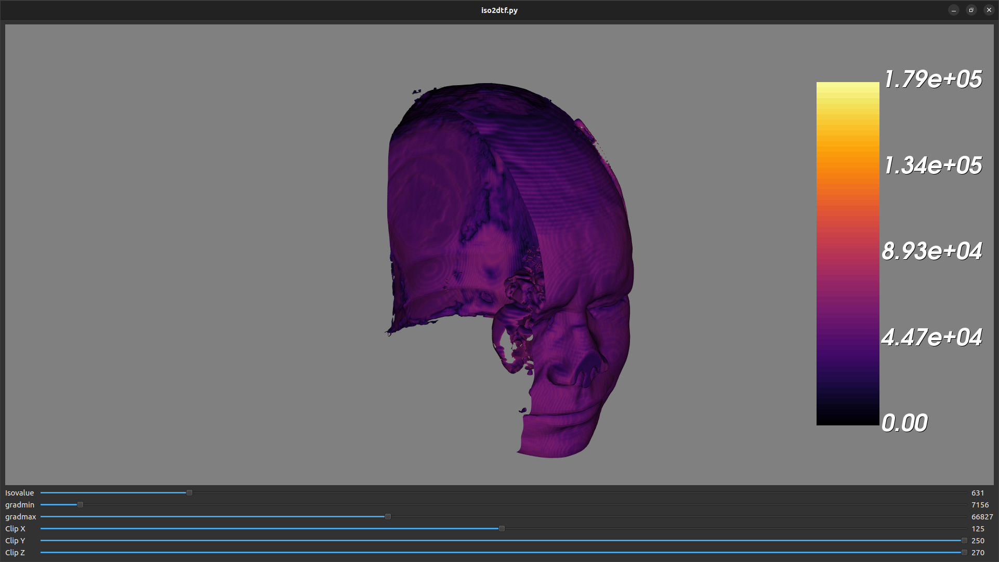
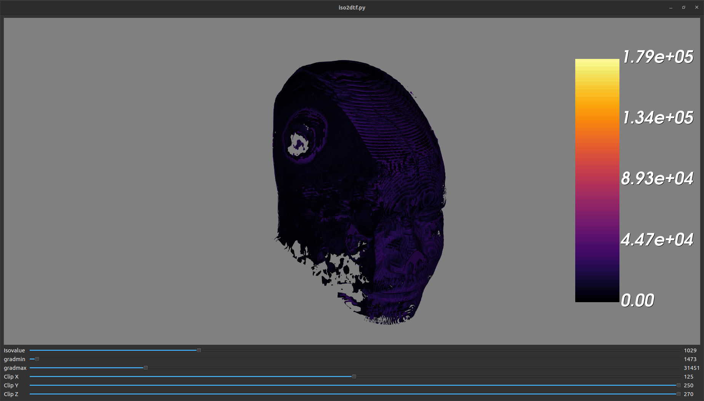
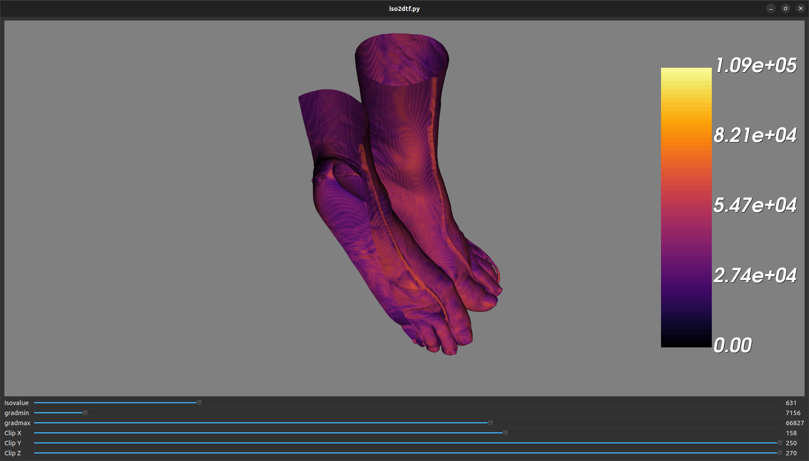

# Report

See [README.md](README.md) for details on how to run the application.

## Task 1 - Interactive Isosurfacing

Isovalues:

- Skin: 403
- Muscle: 1014
- Bone: 1184

### Head

#### Skin

#### Muscle

#### Bone

### Feet

#### Skin

#### Muscle

#### Bone

### Discussion

#### Which isosurfaces look the most interesting and why?

The isosurface of the bone in the head looks the most interesting because it
looks rather different in shape from the other isosurfaces.

#### How did you select the position of clipping planes?

Choosing the X clipping plane to be at the center of the geometry shows the half
of the geometry that is facing the camera, which provides the most details for
the inside and outside of the surface. Choosing the Y and Z clipping planes a
little to show the effect but not too much to present the whole geometry.

## Task 2 - Value vs. Gradient Magnitude

Isovalues:

- Skin: 403
- Muscle: 1014
- Bone: 1184

### Head

### Feet

### Discussion

#### What relationship can you identify between the gradient magnitude distribution of the various isosurfaces?

Each isosurface has a different gradient magnitude distribution. The muscle has
the lowest gradient magnitude and the bone has the highest gradient magnitude on
average.

#### How do you interpret these results? Explain.

Different tissues have different densities and textures. Therefore, the gradient
magnitude distribution of the isosurfaces is different and corresponds to the
different tissues.

#### What does that tell you about the value of the resulting visualization? Explain.

With `vtkProbeFilter` we can map the gradient magnitude to each isosurface. This
provides a more accurate surface representation of each anatomical structure.

## Task 3 - Two-dimensional Transfer Function

### Head

- Skin
  - Isovalue: 631
  - Grad Min: 7156
  - Grad Max: 66827
- Muscle
  - Isovalue: 1029
  - Grad Min: 1473
  - Grad Max: 31451
- Bone
  - Isovalue: 1226
  - Grad Min: 31872
  - Grad Max: 139188

#### Skin

#### Muscle

#### Bone

### Feet

- Skin
  - Isovalue: 631
  - Grad Min: 7156
  - Grad Max: 66827
- Muscle
  - Isovalue: 1029
  - Grad Min: 1473
  - Grad Max: 31451
- Bone
  - Isovalue: 1226
  - Grad Min: 6279
  - Grad Max: 76609

#### Skin

#### Muscle

#### Bone

### Discussion

#### Did the gradient magnitude filtering help in refining the isosurface selection? If so, how? Be specific.

Yes, the gradient magnitude filtering helps in refining the isosurface
selection. We can select the isosurface within a certain range of gradient
magnitude. This helps to remove the noise and provide a more accurate surface
representation.

#### Which isosurfaces benefited the most from this filtering? Why?

The isosurfaces of the skin and muscle benefited the most from this filtering. I
believe this is because the skin and muscle have a lower gradient magnitude
variant than the bone.

## Task 4 - Complete Visualization

See parameters in [assets/params.txt](assets/params.txt).

### Head

### Feet

### Discussion

#### Comment on your selection of the transparency for each isosurface.

Using lower transparency for skin and muscle makes it easier to see the bone
structure. Using higher transparency but not opaque for bone provides a way to
see the tissues on the other side of the bone.

#### Does transparency benefit your visualization, and if so, how? Explain.

Yes, transparency benefits visualization because it provides a way to see the
tissues on the other side of the bone. However, it would be a little hard to see
the details of each tissue.

## Summary Analysis

### What explanation can you offer for this success?

To reach the ultimate goal of visualizing different tissues in the human body,
we built multiple visualization tools to help us extract underlying information
from the data. Based on the information we got, we refined the final
visualization result to make it more accurate without too much noise.

### Comment on the quality of the images you obtained in each case.

In the first task, we select the isosurfaces by eye. The result might not be as
accurate as the result we get in the later tasks. In the second task, we apply
the gradient magnitude to see if there is any relationship between the gradient
magnitude and the isosurface. The color map helps a lot in this task as it
provides a great visual mapping between two data. In the third task, we manually
select the filtering threshold to get the best result. Finally, we apply the
information we got from the previous tasks to the final visualization, which is
the most accurate result in the experiment.

### Discuss any shortcomings of the isosurfacing technique you may have encountered in this project.

Using the isovalue and gradient magnitude to select the tissue might still
include some noise. The method is thus not general enough to be applied to other
parts of the body. For example, the gradient magnitude for the bone of the feet
has a much larger variance than the bone of the head.

### Comment on the role and meaning of gradient magnitude to filter isosurfaces.

It gives a more accurate surface representation of each anatomical structure.
For the same tissue, especially for the skin and muscle, the gradient magnitude
distribution would be close to the same.

### Comment on the benefits and limitations of transparency and clipping planes to enhance the visualization.

Transparency provides a way to see the tissues on the other side of the bone.
However, it would be a little hard to see the details of each tissue.
